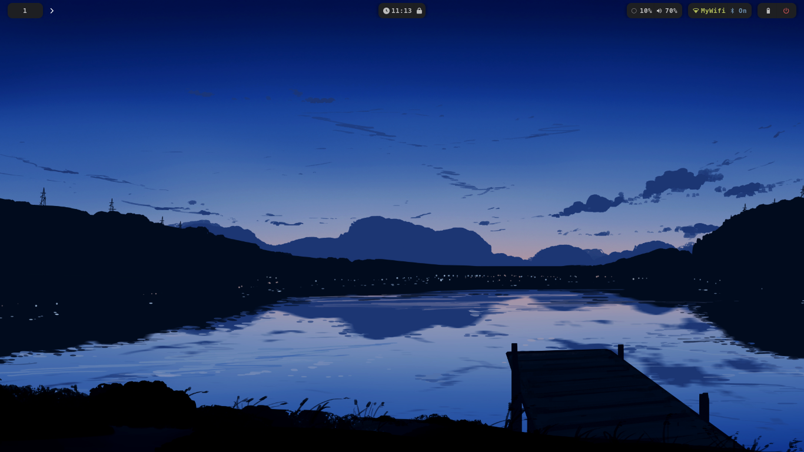
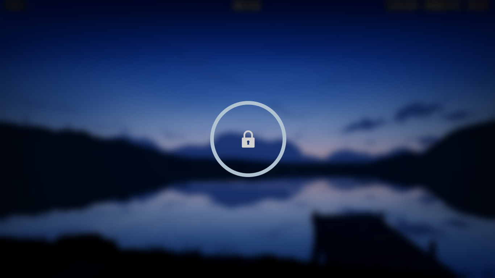
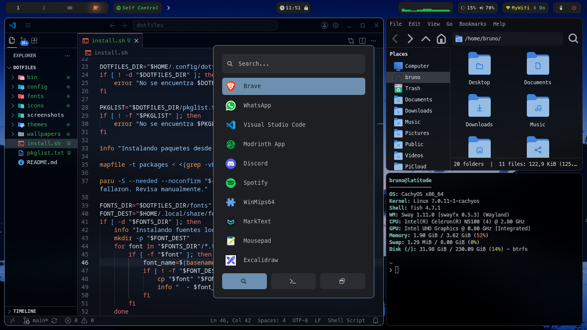
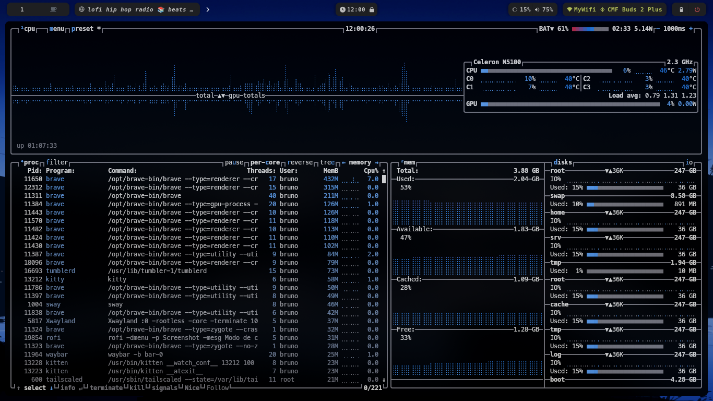

## Dotfiles

### System

- OS: [CachyOS, Arch]

- Shell: Fish

- WM: [SwayFx](https://github.com/WillPower3309/swayfx) 0.5.3 (Wayland)

- Lock: [swaylock-effects](https://github.com/mortie/swaylock-effects)

- Notifications: Dunst

- Terminal: Kitty

- Launcher: [Rofi](https://github.com/adi1090x/rofi)

- Bar: Waybar

### Theme

- Theme: [Graphite-Dark-compact](https://github.com/vinceliuice/Graphite-gtk-theme)

- Icons: [Adwaita](https://gitlab.gnome.org/GNOME/adwaita-icon-theme)

- Font: [MesloLGL Nerd Font](https://github.com/ryanoasis/nerd-fonts)

- Cursor: [Simp1e-Adw-Dark](https://gitlab.com/cursors/simp1e)

### Applications

- File manager: Thunar

- Text editor: [Nano,  Mousepad, VS Code]

- Fetch: Fastfetch

- Media Player:
  
  - Music: [Spotify, Rhythmbox]
  
  - Videos: MPV
  
  - Images: [gThumb, GwenView]

- Browser: Brave

## Screenshots

**Desktop:**

---

**Lockscreen:**

---

**Environment:**

---

**System monitor:**

